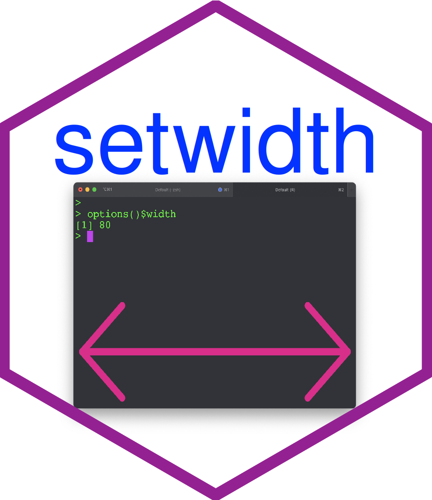

# 'setwidth' R package <a href="https://github.com/dlc48/setwidth"></a>


<h2>Description</h2> 

This package automatically sets `options("width")` when using R in terminal windows on OSX primarily (but on Unix-like OSes too) and resizing the terminal (e.g., iTerm2 on OSX). It may be useful if `options(setWidthOnResize=TRUE)` does not work properly for any reason.


This package should not be used with graphical interfaces such as RStudio, RKward, JGR, Rcmdr, or any other interface that handles R output on its own, or when using R via remote sessions (like via a ssh connection, for example). The functions only work if R runs interactively in a terminal emulator. The terminal emulator may be called by a text editor like Vim, Gedit, Kate, or Geany.


<h2>Installation instructions</h2> 

To install the 'setwidth' package from GitHub run

```r
install.packages("devtools")
devtools::install_github("dlc48/setwidth")
```

<h2>Authors</h2>

* Jakson Alves de Aquino [aut, cre]
* Dominique-Laurent Couturier [maintainer]


